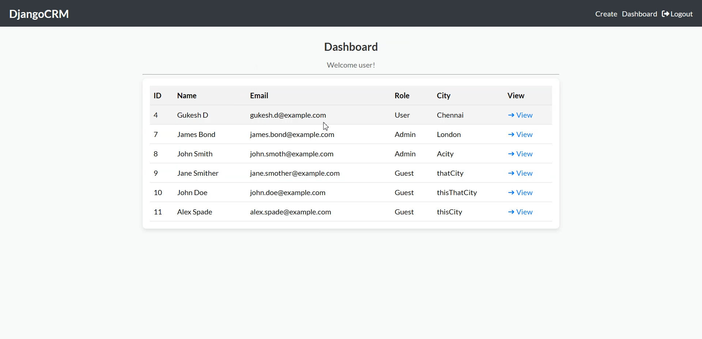
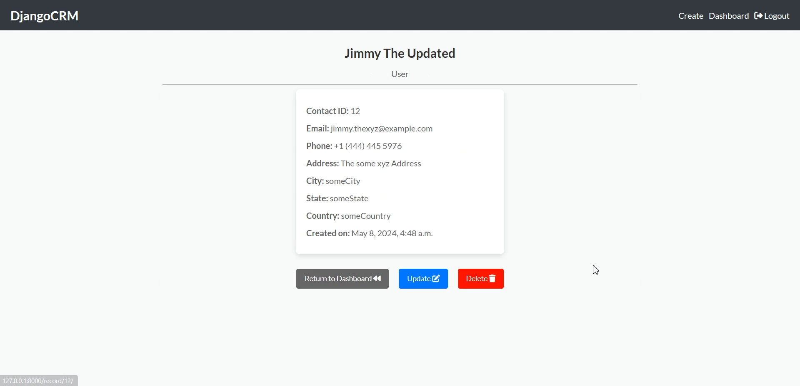

# crm-system
Simple yet powerful Customer Relationship Management (CRM) system built using Django.

A robust Customer Relationship Management (CRM) system crafted with Django, empowering users to streamline their business relationships effortlessly.

### Technologies Used
- HTML (for structuring web pages)
- CSS (for styling)
- Django (for backend development)

### Features
- Manage customer data effortlessly.
- Create, update, and delete records with ease.
- User-friendly interface for seamless navigation.

### Usage
- Add new contacts.
- View and update existing contact details.
- Delete outdated records.

### To Do
- [x] Implement CRUD operations for contact management.
- [x] Integrate login/signup functionality.
- [ ] Enhance user experience with Dark Mode.

### Getting Started
- Clone the repository (git clone <repository_url>).
- Run in your browser.
